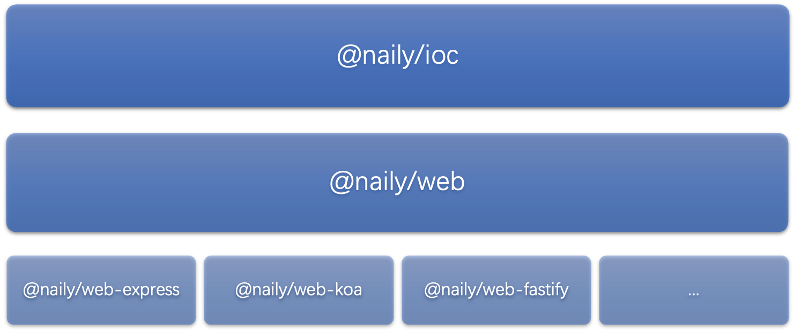

# Web

`@naily/web`包是一个面向 node.js 后端的包，它旨在提供一套完整的 web 后端开发概念，包括`路由`、`中间件`、`控制器`等,皆由这个包管理。

它内部设计了一个`适配器系统`，该适配器系统的作用是将类`Express`框架和类`Koa`框架接入到`Naily容器工厂`中。



## 安装

```bash
npm install @naily/web
```

如果使用脚手架创建的后端项目，无需安装，已经内置。
